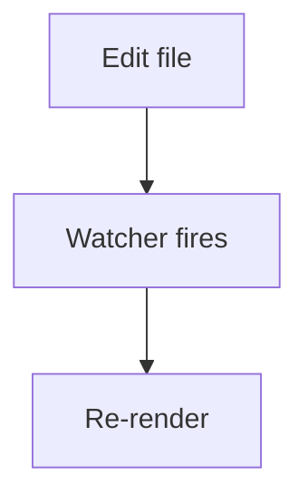

# rsmd Demo

GFM: ~~strike~~, autolink https://example.com, footnote[^1].

| Feature | Status |
| ------- | ------ |
| Tables  | ✅     |

- [x] task done
- [ ] task pending

Inline math $E = mc^2$ and display:

$$\int_0^\infty e^{-x^2} dx = \frac{\sqrt{\pi}}{2}$$

```rust
fn main() {
    println!("highlighted");
}
```




[External link](https://example.com) · [Sibling doc](./other.md)

[^1]: Footnote body.
